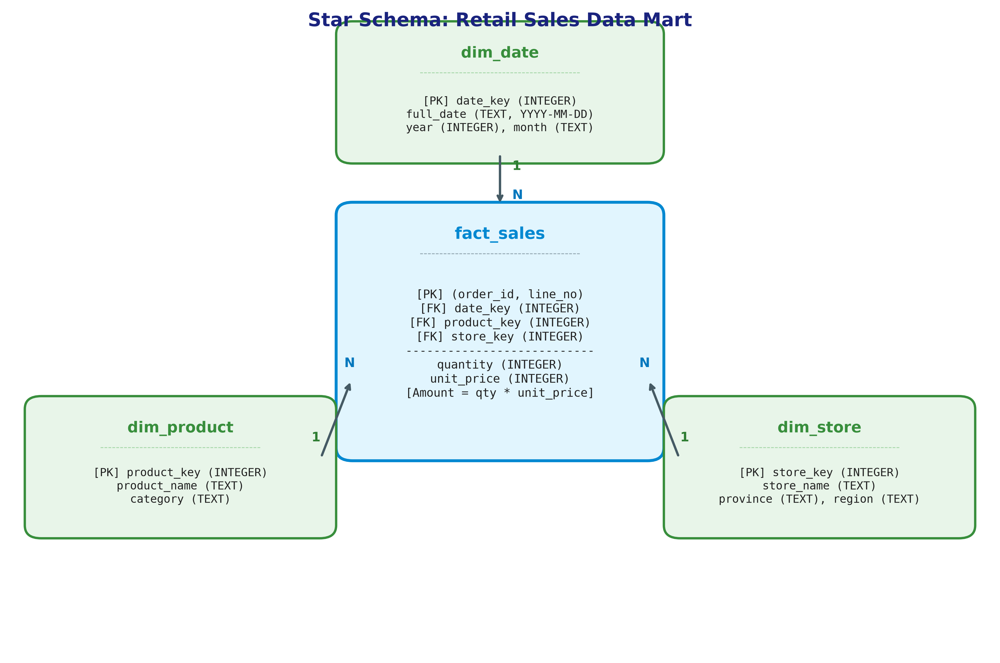

# รายงานแลป OLTP OLAP และ Pivot

**ชื่อ-นามสกุล:** นาย ชนะวิทย์ ตีทั่ง  
**รหัสนิสิต:** 67160167  
**กลุ่มเรียน:** กลุ่ม 1  
**วิชา:** Data Warehouse & Business Intelligence  

---

## 1 OLTP (Online Transaction Processing)

### 1.1 โค้ดที่เติมใน `oltp_demo.py`
ใช้คำสั่ง `UPDATE` แบบมี Guarded Condition โดยตรวจสอบทั้ง `order_id` และ `status` เพื่อความถูกต้องของสถานะธุรกรรม:

```python
from pathlib import Path
import sqlite3

p = Path(__file__).resolve().parent / 'data' / 'oltp.db'
if not p.exists():
    raise SystemExit('Run lab.py first')

with sqlite3.connect(p) as con:
    print('Before:', con.execute('SELECT * FROM orders').fetchall())
    # Guarded UPDATE using WHERE order_id and status
    cur = con.execute("UPDATE orders SET status = 'PAID' WHERE order_id = 'O1004' AND status = 'PENDING'")
    print('Rows updated:', cur.rowcount)
    print('After:', con.execute('SELECT * FROM orders').fetchall())
```

### 1.2 ผลการรันสองรอบ (Two Execution Runs)

**รอบที่ 1 (First Run):**
```text
Before: [('O1004', 'PENDING')]
Rows updated: 1
After: [('O1004', 'PAID')]
```

**รอบที่ 2 (Second Run):**
```text
Before: [('O1004', 'PAID')]
Rows updated: 0
After: [('O1004', 'PAID')]
```

### 1.3 คำอธิบายผลลัพธ์และคำถามท้ายกิจกรรม

1. **จำนวนแถวที่แก้ไขในรอบแรกและรอบสอง:**
   - **รอบแรก:** แก้ไขได้ **1 แถว** เนื่องจากออเดอร์ `O1004` มีสถานะเดิมตรงกับเงื่อนไข `status = 'PENDING'`
   - **รอบสอง:** แก้ไขได้ **0 แถว** เนื่องจากสถานะของ `O1004` ถูกเปลี่ยนเป็น `'PAID'` ไปแล้วตั้งแต่รอบแรก ทำให้ไม่ตรงกับเงื่อนไข `status = 'PENDING'` อีกต่อไป

2. **เหตุผลที่ต้องมีเงื่อนไข `status = 'PENDING'` (Guarded Update):**
   - เพื่อทำ **Optimistic Concurrency Control** และสร้างคุณสมบัติ **Idempotency** ในการประมวลผลธุรกรรม
   - ป้องกันปัญหา **Lost Update** และ **Race Condition** ในระบบที่มีผู้ใช้หลายคน (Concurrent Users) เช่น หากลูกค้ายกเลิกออเดอร์ไปแล้ว (`status = 'CANCELLED'`) หรือมีการชำระเงินซ้ำ คำสั่งนี้จะไม่ไปเขียนทับสถานะเดิมโดยพลการ

3. **เหตุใดกิจกรรมนี้จึงจัดเป็น OLTP แม้จะมีคำสั่ง SELECT ร่วมด้วย?**
   - เพราะมีลักษณะการทำงานที่เป็นหัวใจของ **OLTP (Online Transaction Processing)** ได้แก่:
     - ทำงานกับข้อมูลระดับแถวเดี่ยว/รายการเดียว (Single-row/Transaction-level operation)
     - มีการ Read-Modify-Write แบบ Real-time ที่เน้นความรวดเร็วและคงสภาพความถูกต้อง
     - ปฏิบัติตามคุณสมบัติ **ACID (Atomicity, Consistency, Isolation, Durability)** เพื่อรักษาความถูกต้องของสถานะทางธุรกิจ

4. **การเปลี่ยน `oltp.db` ทำให้ยอดใน `warehouse.db` เปลี่ยนทันทีหรือไม่ และระบบจริงควรมีกระบวนการใดเชื่อมข้อมูล?**
   - **ไม่เปลี่ยนทันที:** เพราะฐานข้อมูล OLTP และ Data Warehouse ถูกออกแบบแยกกันโดยเด็ดขาด (Decoupled Architectures) เพื่อไม่ให้ภาระงานวิเคราะห์ (Analytical Queries) กระทบต่อประสิทธิภาพของระบบรับคำสั่งซื้อหน้าร้าน
   - **กระบวนการเชื่อมข้อมูลในระบบจริง:** ต้องมีระบบ **ETL (Extract, Transform, Load)** หรือ **ELT** หรือการทำ **CDC (Change Data Capture)** เช่น Debezium หรือ Kafka ที่คอยดักจับการเปลี่ยนแปลงสถานะออเดอร์ที่ชำระเงินสำเร็จ (`PAID`) จาก OLTP แล้วดึงมาประมวลผลเข้าสู่ Staging Area ก่อนโหลดเข้าสู่ Data Warehouse ตามรอบเวลา (Batch Processing เช่น ทุกคืน) หรือแบบกึ่งเรียลไทม์ (Streaming/Micro-batch)

---

## 2 Grain และ Star Schema

### 2.1 นิยาม Grain และตัวอย่าง O1001
- **Grain ของ `fact_sales`:** คือ **"ยอดขายของสินค้า 1 รายการย่อย (1 Line Item) ใน 1 ใบสั่งซื้อ (1 Order) ณ วันที่และสาขาที่เกิดรายการขาย"**
- **ตัวอย่างออเดอร์ `O1001` (มีหลายแถว):** ในใบสั่งซื้อเดียวกัน ลูกค้าซื้อสินค้า 2 ชนิด จึงบันทึกเป็น 2 แถวตาม `line_no`:
  - `(order_id='O1001', line_no=1)`: วันที่ 2026-08-08, สาขา Bangsaen, ซื้อ Tea (รหัส 1) จำนวน 2 ชิ้น ราคาชิ้นละ 50 บาท (ยอด 100 บาท)
  - `(order_id='O1001', line_no=2)`: วันที่ 2026-08-08, สาขา Bangsaen, ซื้อ Cookie (รหัส 2) จำนวน 1 ชิ้น ราคาชิ้นละ 80 บาท (ยอด 80 บาท)

### 2.2 โครงสร้าง Star Schema
แผนภาพ Star Schema ประกอบด้วย 1 Fact Table ตรงกลาง และ 3 Dimension Tables ล้อมรอบ:



| ตาราง | บทบาท | คีย์หลัก (PK) / คีย์นอก (FK) | แอตทริบิวต์อื่น ๆ | ความสัมพันธ์กับ Fact |
| :--- | :--- | :--- | :--- | :--- |
| **`fact_sales`** | Fact Table | **PK:** `(order_id, line_no)`<br>**FK:** `date_key`, `product_key`, `store_key` | `quantity` (Measure)<br>`unit_price` (Measure/Price Attribute)<br>`amount` = quantity × unit_price | - |
| **`dim_date`** | Dimension Table | **PK:** `date_key` | `full_date`, `year`, `month` | 1 : N กับ `fact_sales` |
| **`dim_product`** | Dimension Table | **PK:** `product_key` | `product_name`, `category` | 1 : N กับ `fact_sales` |
| **`dim_store`** | Dimension Table | **PK:** `store_key` | `store_name`, `province`, `region` | 1 : N กับ `fact_sales` |

### 2.3 ผลการรัน `q01.sql`

```sql
SELECT
    COUNT(*) AS line_count,
    COUNT(DISTINCT order_id) AS order_count,
    SUM(quantity) AS units,
    SUM(amount) AS revenue
FROM sales;
```

**ผลลัพธ์ที่ได้:**
```text
line_count	order_count	units	revenue
8	6	23	1390
```

- **จำนวนรายการ (`line_count`):** 8 รายการ
- **จำนวนออเดอร์ (`order_count`):** 6 ออเดอร์
- **จำนวนชิ้น (`units`):** 23 ชิ้น
- **ยอดขายรวม (`revenue`):** 1,390 บาท

*(ตรงกับข้อมูลจริงในไฟล์ `data/warehouse.csv` ทุกประการ)*

### 2.4 มิติ (Dimensions), มาตรวัด (Measures) และลำดับชั้น (Hierarchy)
- **3 Dimensions:**
  1. `dim_date` (มิติเวลา)
  2. `dim_product` (มิติสินค้า)
  3. `dim_store` (มิติสถานที่/ร้านค้า)
- **2 Measures หลัก:**
  1. `quantity` (จำนวนชิ้นที่ขาย - Additive)
  2. `amount` หรือ `revenue` (ยอดขายรวมหน่วยบาท - Additive)
- **Hierarchy อย่างละ 1 เส้นทาง:**
  - **มิติเวลา (Time Hierarchy):** `full_date` (วัน) $\rightarrow$ `month` (เดือน) $\rightarrow$ `year` (ปี)  
    *ตัวอย่าง:* `2026-08-08` $\rightarrow$ `2026-08` $\rightarrow$ `2026`
  - **มิติสถานที่ (Location Hierarchy):** `store_name` (สาขา) $\rightarrow$ `province` (จังหวัด) $\rightarrow$ `region` (ภูมิภาค)  
    *ตัวอย่าง:* `Bangsaen` $\rightarrow$ `Chonburi` $\rightarrow$ `East`
- **ทำไม `unit_price` จึงไม่ควรนำมาบวกเป็นยอดขาย:**
  เพราะ `unit_price` เป็นข้อมูลราคาต่อหน่วย (Price Intensity) ซึ่งจัดเป็น **Non-additive measure** การนำราคาต่อหน่วยของแต่ละแถวมาหาผลรวม (`SUM(unit_price)`) ไม่มีความหมายทางธุรกิจและให้ค่าที่ผิดเพี้ยน ยอดขายรวม (Revenue) จะต้องเกิดจากการนำปริมาณคูณด้วยราคาต่อหน่วยของแต่ละรายการ คือ $\sum (\text{quantity} \times \text{unit\_price})$ เท่านั้น

---

## 3 OLAP (Online Analytical Processing)

### 3.1 สรุปผลคำสั่ง `q02` – `q07` และ `q12`

| ไฟล์ | ชื่อ Operation | คำอธิบายและผลลัพธ์ทางธุรกิจ |
| :--- | :--- | :--- |
| **`q02.sql`** | **Roll-up** | สรุปยอดขายรวมจากระดับวันขึ้นสู่ระดับเดือน เรียงตามเดือน<br>- `2026-08`: **490 บาท**<br>- `2026-09`: **900 บาท** |
| **`q03.sql`** | **Add Dimension / Cross-dimensional** | เพิ่มมิติสถานที่ (`province`) ในการแจกแจงยอดขายรายเดือน<br>- `2026-08, Bangkok`: **310 บาท**<br>- `2026-08, Chonburi`: **180 บาท**<br>- `2026-09, Bangkok`: **540 บาท**<br>- `2026-09, Chonburi`: **360 บาท** |
| **`q04.sql`** | **Drill-down** | เจาะลึกลงในมิติเวลาจากเดือนลงสู่รายวัน เฉพาะเดือนกันยายน<br>- `2026-09-09`: **360 บาท**<br>- `2026-09-10`: **300 บาท**<br>- `2026-09-11`: **240 บาท** |
| **`q05.sql`** | **Slice** | ตัดระนาบข้อมูลเฉพาะเดือนกันยายน (`month = '2026-09'`) แล้วสรุปยอดรายจังหวัด<br>- `Bangkok`: **540 บาท**<br>- `Chonburi`: **360 บาท** |
| **`q06.sql`** | **Dice** | ตัดลูกบาศก์ย่อยด้วยหลายมิติพร้อมกัน (`month='2026-09'`, `category='Drink'`, `province IN ('Bangkok', 'Chonburi')`)<br>- `Drink, Bangkok`: **300 บาท**<br>- `Drink, Chonburi`: **200 บาท** |
| **`q07.sql`** | **Slice with Having Filter** | กรองเฉพาะเดือนกันยายน สรุปรายจังหวัด และเลือกเฉพาะจังหวัดที่ยอดขายรวมเกิน 400 บาท<br>- `Bangkok`: **540 บาท** *(Chonburi ยอด 360 บาท ถูกกรองออก)* |
| **`q12.sql`** | **Drill-through** | เจาะทะลุจากข้อมูลสรุปย้อนกลับไปยังระดับรายการธุรกรรมย่อย (Detailed Line Items) ของกรุงเทพฯ เดือนกันยายน<br>- `O1005, line 1, Tea, 6 ชิ้น, 300 บาท`<br>- `O1006, line 1, Cookie, 3 ชิ้น, 240 บาท` |

### 3.2 คำตอบคำถามระหว่างทำ

- **ข้อ ก. `q03` เพิ่มมิติสถานที่ ส่วน `q04` เพิ่มรายละเอียดภายในมิติเวลา ทั้งสองกรณีทำให้การอ่านผลต่างกันอย่างไร?**
  - `q03` เป็นการขยายมุมมองข้ามมิติ (Cross-dimensional analysis) ช่วยให้เปรียบเทียบผลงานและสัดส่วนยอดขายระหว่างพื้นที่ (กรุงเทพฯ vs ชลบุรี) ในแต่ละช่วงเวลาได้
  - `q04` เป็นการเจาะลึกลำดับชั้นภายในมิติเดิม (Intra-dimensional drill-down) ช่วยให้เห็นความถี่และแนวโน้มการซื้อขายในแต่ละวันของเดือน ทำให้ตรวจจับวันที่มียอดขายสูงสุดได้
- **ข้อ ข. `q07` ต้องกรองเดือนใน WHERE หรือ HAVING และยอด SUM(amount) ควรกรองตรงไหน?**
  - เงื่อนไขเดือน (`WHERE month = '2026-09'`) ต้องกรองใน **`WHERE`** เพราะเป็นการคัดกรองแถวข้อมูลดิบก่อนนำไปจัดกลุ่มคำนวณ (Pre-aggregation)
  - เงื่อนไขยอดขายรวม (`HAVING SUM(amount) > 400`) ต้องกรองใน **`HAVING`** เพราะเป็นการคัดกรองค่าที่ได้จากการคำนวณแบบกลุ่มหลังจากการ `GROUP BY` แล้ว (Post-aggregation)
- **ข้อ ค. เมื่อนำรายการจาก `q12` มารวมกัน ควรเท่ากับช่องใดใน `q03`?**
  - ผลรวมของ `amount` ใน `q12` คือ $300 + 240 = 540$ บาท ซึ่งเท่ากับช่อง **`month = '2026-09'` และ `province = 'Bangkok'`** ในผลลัพธ์ของ `q03` พอดี

---

## 4 Pivot Table

### 4.1 โค้ดและผลรัน `q08.sql`
การสร้าง Pivot Table ด้วย SQL แบบ Cross-Tabulation โดยใช้ `SUM(CASE WHEN ...)`:

```sql
SELECT
    province,
    SUM(CASE WHEN month = '2026-08' THEN amount ELSE 0 END) AS aug,
    SUM(CASE WHEN month = '2026-09' THEN amount ELSE 0 END) AS sep,
    SUM(amount) AS total
FROM sales
GROUP BY province
ORDER BY province;
```

**ผลลัพธ์ `q08.sql`:**
```text
province	aug	sep	total
Bangkok	310	540	850
Chonburi	180	360	540
```

### 4.2 ผลรัน Python P1 และ P2 (`pivot_student.py`)

**ตาราง P1 (`pivot_province_month.csv`):**
```text
month     2026-08  2026-09  Total
province                         
Bangkok       310      540    850
Chonburi      180      360    540
Total         490      900   1390
```

**ตาราง P2 (`pivot_september.csv`):**
```text
province  Bangkok  Chonburi  Total
category                          
Drink         300       200    500
Snack         240       160    400
Total         540       360    900
```

### 4.3 ผลการทดสอบ Assertion (P3)
คำสั่งตรวจสอบความถูกต้อง:
```python
grand_total = p1.loc['Total', 'Total']
actual_sum = df['amount'].sum()
assert grand_total == actual_sum
```
- **ผลลัพธ์:** ผ่านการตรวจสอบ (`Assert passed! Grand Total = 1390 บาท`)

### 4.4 ผลการทดลองข้อผิดพลาด (เมื่อลบ `aggfunc`)
- **ผลที่ได้เมื่อลบ `aggfunc`:**
  ช่อง `Bangkok` เดือน `2026-09` แสดงค่าเป็น **270.0** และ Grand Total แสดงค่าเป็น **173.75**
- **สาเหตุที่ได้ 270.0 และความหมาย:**
  เนื่องจากฟังก์ชัน `pd.pivot_table()` ของ pandas มีค่าปริยาย (Default) ของพารามิเตอร์ `aggfunc` เป็น `'mean'` (ค่าเฉลี่ย) ไม่ใช่ผลรวม (`'sum'`)  
  ในเดือนกันยายน สาขากรุงเทพฯ มีรายการขาย 2 รายการ คือ 300 บาท และ 240 บาท ค่าเฉลี่ยจึงได้ $\frac{300 + 240}{2} = 270.0$ บาท ซึ่งแสดงถึง **"มูลค่าเฉลี่ยต่อรายการสินค้า"** ไม่ใช่ยอดขายรวม
- **การแก้ไข:** กำหนดพารามิเตอร์ `aggfunc='sum'` ให้ชัดเจน

### 4.5 ผลการทดลอง Excel PivotTable (กรอง Drink)
สร้างไฟล์ `pivot.xlsx` และกำหนดการจัดวางดังนี้:
- **Rows:** `province`
- **Columns:** `month`
- **Values:** `Sum of amount`
- **Filters:** `category = 'Drink'`

**ผลลัพธ์ตาราง Pivot เมื่อกรองเฉพาะหมวด Drink:**
```text
month     2026-08  2026-09  Total
province                         
Bangkok       150      300    450
Chonburi      100      200    300
Total         250      500    750
```

- **ยอดรวมหลังกรอง Drink:** **750** บาท
- **แกน Rows:** `province`
- **แกน Columns:** `month`
- **แกน Values:** `Sum of amount`
- **ข้อแตกต่างของ sum กับ mean:**
  - `sum`: รวมมูลค่ายอดขายทั้งหมดเข้าด้วยกันเพื่อดูขนาดของรายได้รวม (Total Revenue)
  - `mean`: คำนวณยอดขายเฉลี่ยต่อ 1 รายการแถวข้อมูล (Average Transaction Line Size) ไม่สะท้อนขนาดของยอดขายรวม

### 4.6 คำถามชวนคิด: การเพิ่มเดือนตุลาคม
- **ใน SQL (Static Pivot):** คำสั่ง SQL ที่เขียน `SUM(CASE WHEN month = '2026-08' ...)` จะ **ไม่แสดงคอลัมน์ใหม่โดยอัตโนมัติ** หากต้องการคอลัมน์เดือนตุลาคม ผู้พัฒนาจะต้องแก้ไขคำสั่ง SQL เพิ่มบรรทัด `SUM(CASE WHEN month = '2026-10' THEN amount ELSE 0 END) AS oct` ด้วยตนเอง
- **ใน pandas (Dynamic Pivot):** พารามิเตอร์ `columns='month'` จะทำการสแกนหาค่าที่ไม่ซ้ำ (Unique Values) จากคอลัมน์ `month` ของข้อมูลขาเข้าโดยอัตโนมัติ ดังนั้นเมื่อมีข้อมูลเดือน `2026-10` เพิ่มเข้ามา pandas จะสร้างคอลัมน์ `2026-10` ให้เองทันทีโดยไม่ต้องแก้ไขโค้ด

---

## 5 ตรวจความถูกต้องของข้อมูล (Data Validation)

### 5.1 ผลการรัน `q09.sql` และปัญหา Double Counting

```sql
SELECT month, SUM(amount) AS revenue
FROM sales
GROUP BY month
UNION ALL
SELECT 'ALL' AS month, SUM(amount) AS revenue
FROM sales;
```

**ผลลัพธ์ `q09.sql`:**
```text
month	revenue
2026-08	490
2026-09	900
ALL	1390
```

- **คำอธิบาย:** แถว `'ALL'` เกิดจากการคำนวณยอดขายรวมของทุกเดือน ($490 + 900 = 1,390$) หากมีผู้นำตารางผลลัพธ์นี้ไปใส่สูตร `SUM(revenue)` ซ้ำอีกรอบ ยอดรวมจะกลายเป็น $490 + 900 + 1390 = 2,780$ บาท เกิดข้อผิดพลาดร้ายแรงที่เรียกว่า **Double Counting (การนับซ้ำสองเท่า)** ดังนั้นข้อมูลระดับสรุปยอดรวม (Summary/Subtotal row) ต้องแยกชั้นจากข้อมูลรายละเอียดเสมอ

### 5.2 ผลการรัน `q10.sql` และการเปรียบเทียบ AOV กับ AVG(amount)

```sql
SELECT
    SUM(amount) AS revenue,
    COUNT(DISTINCT order_id) AS orders,
    ROUND(1.0 * SUM(amount) / COUNT(DISTINCT order_id), 2) AS aov,
    ROUND(AVG(amount), 2) AS avg_line
FROM sales;
```

**ผลลัพธ์ `q10.sql`:**
```text
revenue	orders	aov	avg_line
1390	6	231.67	173.75
```

- **การเปรียบเทียบหน่วยและความหมาย:**
  - **AOV (Average Order Value = 231.67):** มีหน่วยเป็น **"บาทต่อออเดอร์" (Baht/Order)** วัดจากยอดขายรวมหารด้วยจำนวนใบสั่งซื้อที่ไม่ซ้ำกัน (`COUNT(DISTINCT order_id)`) สะท้อนพฤติกรรมการจ่ายต่อตะกร้าสินค้าของลูกค้า
  - **avg_line (AVG(amount) = 173.75):** มีหน่วยเป็น **"บาทต่อรายการสินค้า" (Baht/Line Item)** วัดจากยอดขายรวมหารด้วยจำนวนแถวรายการสินค้าทั้งหมด (`COUNT(*)`) ซึ่งต่ำกว่า AOV เสมอหากในหนึ่งออเดอร์มีการสั่งซื้อสินค้ามากกว่า 1 รายการ

### 5.3 ผลการรัน `q11.sql` และการตรวจสอบ Referential Integrity

```sql
SELECT
    'fact_sales (before JOIN)' AS source,
    COUNT(*) AS row_count,
    SUM(quantity * unit_price) AS total_amount
FROM fact_sales
UNION ALL
SELECT
    'sales (after JOIN)' AS source,
    COUNT(*) AS row_count,
    SUM(amount) AS total_amount
FROM sales;
```

**ผลลัพธ์ `q11.sql`:**
```text
source	row_count	total_amount
fact_sales (before JOIN)	8	1390
sales (after JOIN)	8	1390
```

- ผลการรัน `PRAGMA foreign_key_check;` ได้ผลลัพธ์ว่างเปล่า (ไม่มี Foreign Key ผิดพลาด)
- **คำอธิบายผลกระทบของ JOIN:**
  - **กรณีมี Foreign Key ตกหล่น (Orphan Fact Rows):** หากใน Fact มีคีย์มิติที่ไม่มีตัวตนในตาราง Dimension เมื่อทำ `INNER JOIN` แถวนั้นใน Fact จะถูกทิ้งไป ส่งผลให้จำนวนแถวลดลงและยอดขายรวมในคลังข้อมูล **ขาดหายไปจากความเป็นจริง (Underreported Revenue)**
  - **กรณีมีคีย์ซ้ำในมิติ (Duplicate Dimension Keys):** หากตารางมิติมีคีย์หลักซ้ำกัน การ JOIN จะกลายเป็นความสัมพันธ์ 1:N หรือ M:N ทำให้แถวใน Fact ถูกคูณเพิ่มขึ้น ส่งผลให้ยอดขายรวม **บวมเกินจริง (Overreported Revenue)**

### 5.4 ประเภทของมาตรวัด (Measures) และวิธีการรวมที่เหมาะสม

1. **Additive Measure (มาตรวัดที่บวกได้ทุกมิติ):**
   - *ตัวอย่าง:* `amount` (ยอดขาย), `quantity` (จำนวนชิ้น)
   - *วิธีรวม:* สามารถใช้ฟังก์ชัน `SUM()` บวกข้ามมิติเวลา สินค้า หรือสถานที่ได้อย่างอิสระ
2. **Semi-additive Measure (มาตรวัดที่บวกได้บางมิติ แต่ห้ามบวกข้ามเวลา):**
   - *ตัวอย่าง:* **ยอดสต็อกสินค้าคงคลังสิ้นวัน (Ending Inventory Balance)** หรือยอดเงินคงเหลือในบัญชีธนาคาร
   - *วิธีรวม:* สามารถบวกข้ามมิติสินค้าหรือสาขาได้ แต่ **ห้ามนำสต็อกของแต่ละวันมาบวกกันข้ามเวลา** เพราะไม่ใช่สินค้าใหม่ การรวมข้ามเวลาต้องใช้ค่า ณ จุดเวลาสิ้นสุด (Period-ending snapshot) เช่น สต็อก ณ สิ้นเดือน หรือคำนวณเป็นค่าเฉลี่ยรายวัน (Average)
3. **Non-additive Measure (มาตรวัดที่ไม่สามารถบวกข้ามมิติใดๆ ได้เลย):**
   - *ตัวอย่าง:* `unit_price` (ราคาต่อหน่วย), `AOV` (ยอดซื้อเฉลี่ยต่อออเดอร์), อัตรากำไรขั้นต้น (%)
   - *วิธีรวม:* **ห้ามนำค่าของแต่ละกลุ่มมาบวกกันหรือหาค่าเฉลี่ยตรงๆ (Average of Averages)** การรวมข้ามมิติหรือข้ามเดือนต้องคำนวณใหม่จากสูตรอัตราส่วนตั้งต้นเสมอ:
     $$\text{AOV}_{\text{Total}} = \frac{\sum \text{Total Revenue}}{\sum \text{Total Distinct Orders}}$$

---

## 6 สรุปผลการปฏิบัติการ

### 6.1 ข้อค้นพบสำคัญจากข้อมูล (Key Findings) อย่างน้อย 2 ข้อ
1. **ยอดขายเติบโตสูงในเดือนกันยายน แต่ไม่สามารถด่วนสรุปว่ามาจากโปร 9.9 ได้:**
   - ยอดขายรวมเพิ่มขึ้นจาก 490 บาท ในเดือนสิงหาคม เป็น 900 บาท ในเดือนกันยายน (เติบโตขึ้นถึง 83.67%) โดยเฉพาะช่วงวันที่ 9–11 ก.ย. ที่มียอดขายเกิดขึ้นต่อเนื่อง
   - **ข้อควรระวังสำคัญตามใบงาน:** การจะอ้างว่ายอดขายที่เพิ่มขึ้นนี้เกิดจาก **"แคมเปญโปรโมชัน 9.9" ไม่สามารถสรุปได้จากตารางยอดขายเพียงอย่างเดียว** เนื่องจากในตาราง `sales` หรือ `fact_sales` ไม่มีมิติด้านแคมเปญการตลาด (`campaign_id`), ข้อมูลส่วนลด (`discount_amount`), หรือหลักฐานการจัดกิจกรรมส่งเสริมการขายใดๆ มารองรับ การที่ยอดขายเพิ่มขึ้นอาจเกิดจากปัจจัยอื่น เช่น การเพิ่มสต็อกสินค้า, การเปิดรับออเดอร์กลุ่มลูกค้าองค์กร, หรือความบังเอิญของพฤติกรรมการซื้อ การสรุปผลทางธุรกิจจึงต้องมีข้อมูลหรือหลักฐานเชิงประจักษ์จากตารางแคมเปญภายนอกประกอบเสมอ
2. **ความไม่สมดุลเชิงพื้นที่และสินค้าขับเคลื่อนรายได้ (Geographic & Product Disparity):**
   - จังหวัดกรุงเทพฯ ครองสัดส่วนรายได้หลักของธุรกิจ โดยสร้างยอดขายรวม 850 บาท (คิดเป็น 61.15%) สูงกว่าจังหวัดชลบุรีที่ทำได้ 540 บาท (38.85%)
   - เมื่อพิจารณารายสินค้า พบว่าหมวด **Drink (Tea)** มียอดขายรวม 750 บาท คิดเป็น 53.96% ของยอดรวมทั้งหมด โดยเฉพาะในเดือนกันยายน สาขากรุงเทพฯ มีการสั่งซื้อ Tea รายการเดียวถึง 6 ชิ้น (300 บาท) ซึ่งเป็นปัจจัยหลักที่ผลักดันยอดขายของเดือนกันยายนให้พุ่งสูง

### 6.2 ข้อจำกัดของข้อมูล (Data Limitation) อย่างน้อย 1 ข้อ
- **ขนาดตัวอย่างมีจำกัดและขาดมิติธุรกิจที่สำคัญ:** ข้อมูลในชุดหลัก (`warehouse.db`) มีเพียง 8 รายการ จาก 6 ออเดอร์ ครอบคลุมเพียง 2 เดือน 2 สินค้า และ 2 สาขา ทำให้ไม่สามารถทดสอบนัยสำคัญทางสถิติหรือวิเคราะห์แนวโน้มเชิงพยากรณ์ได้อย่างน่าเชื่อถือ นอกจากนี้ คลังข้อมูลยังขาดมิติ **ต้นทุน (Cost/COGS)** ทำให้ไม่สามารถคำนวณกำไรขั้นต้น (Gross Profit) หรือกำไรสุทธิ (Net Margin) ได้ และขาด **มิติลูกค้า (Customer Demographics)** ทำให้ไม่สามารถวิเคราะห์พฤติกรรมการซื้อซ้ำหรือ Customer Lifetime Value (CLV) ได้

### 6.3 การใช้ Generative AI, Prompt สำคัญ และจุดที่ตรวจแก้ด้วยตนเอง

#### 1. การใช้ AI และ Prompt สำคัญที่ใช้:
ในการทำแลปนี้ มีการนำ Generative AI (Google Antigravity) มาช่วยในการออกแบบโครงสร้าง SQL และสคริปต์การวิเคราะห์ โดยมี Prompt สำคัญดังนี้:

> **ตัวอย่าง Prompt สำคัญ:**  
> *"จาก Star Schema ที่มี fact_sales (order_id, line_no, date_key, product_key, store_key, quantity, unit_price) และ sales view จงเขียนคำสั่ง SQL สำหรับ q08 ถึง q11 โดย q08 ให้ทำ Pivot Table ด้วย SUM(CASE WHEN...) แยกคอลัมน์ aug, sep, total, q10 ให้คำนวณ AOV และ avg_line พร้อมปัดเศษทศนิยม 2 ตำแหน่ง และ q11 ให้ตรวจสอบ Referential Integrity ก่อนและหลัง JOIN พร้อมอธิบายผลกระทบของ Orphan fact rows และ Duplicate dimension keys"*

#### 2. จุดสำคัญที่ตรวจแก้ด้วยตนเอง (Self-Correction & Verification):
1. **การตรวจแก้ฟังก์ชัน Pivot Table ใน pandas (`pivot_student.py`):**  
   - เมื่อนำโค้ดเริ่มต้นไปรันโดยไม่ได้ระบุ `aggfunc` พบว่าค่าของ Bangkok เดือนกันยายนออกมาเป็น **270 บาท** แทนที่จะเป็น **540 บาท**  
   - **การตรวจแก้:** ตรวจสอบพบว่าค่าเริ่มต้น (Default) ของ `pd.pivot_table()` ใน pandas คือ `aggfunc='mean'` (ค่าเฉลี่ย) ไม่ใช่ผลรวม จึงได้ทำการแก้ไขโค้ดด้วยตนเองโดยระบุ `aggfunc='sum'` ให้ถูกต้อง พร้อมเขียนคำสั่ง `assert p1.loc['Total', 'Total'] == df['amount'].sum()` เพื่อการันตียอด Grand Total 1,390 บาทอย่างแม่นยำ
2. **การตรวจแก้การคำนวณทศนิยมใน SQLite (`q10.sql`):**  
   - ใน SQLite หากเขียน `SUM(amount) / COUNT(DISTINCT order_id)` ตรงๆ จะเกิด **Integer Division** (การหารจำนวนเต็ม) ซึ่งตัดเศษทศนิยมทิ้ง ทำให้ได้ AOV เท่ากับ 231 แทนที่จะเป็น 231.67  
   - **การตรวจแก้:** ได้แก้ไขด้วยตนเองโดยเติม `1.0 * SUM(amount)` เพื่อบังคับให้แปลงเป็นตัวเลขทศนิยม (Real Float) ก่อนนำไปหาร และครอบด้วย `ROUND(..., 2)` ทำให้ได้ผลลัพธ์ทศนิยม 2 ตำแหน่งที่ถูกต้องคือ `231.67`
3. **การตรวจสอบข้อผิดพลาดในการรวม AOV ข้ามเดือน (Challenge A):**  
   - ตรวจพบว่าการหาค่าเฉลี่ยของ AOV รายเดือนตรงๆ $((453.81 + 461.02 + 432.32) / 3 = 449.05)$ ให้ค่าที่ไม่ตรงกับ Overall AOV จริง ($448.86$ บาท)  
   - **การตรวจแก้:** ได้ระบุคำอธิบายในรายงานว่า AOV เป็น Non-additive metric เนื่องจากแต่ละเดือนมีจำนวนออเดอร์ (ตัวหาร/น้ำหนัก) ไม่เท่ากัน การรวมข้ามเดือนจึงต้องใช้ผลรวมยอดขายทั้งหมดหารด้วยผลรวมออเดอร์ทั้งหมดเท่านั้น

---

## 7 โจทย์ต่อยอด (Challenge Tasks)

### 7.1 Challenge A: การวิเคราะห์ชุดข้อมูลขยาย (`extended.db`)
ประมวลผลข้อมูลจำลองขนาด 3,649 รายการ จาก 1,800 ออเดอร์ ด้วยสคริปต์ `challenge.py`:

#### 1. 3 สาขาที่มียอดขายสูงสุด
| ลำดับ | สาขา (`store_name`) | จังหวัด (`province`) | ภูมิภาค (`region`) | ยอดขายรวม (`total_revenue`) |
| :---: | :--- | :--- | :--- | :---: |
| 1 | **Nimman** | Chiang Mai | North | **145,280 บาท** |
| 2 | **Pattaya** | Chonburi | East | **141,215 บาท** |
| 3 | **Muang Rayong** | Rayong | East | **136,710 บาท** |

#### 2. ยอดขายและ AOV รายเดือน
| เดือน (`month`) | ยอดขายรวม (`revenue`) | จำนวนออเดอร์ (`orders`) | AOV (บาท/ออเดอร์) |
| :---: | :---: | :---: | :---: |
| **2026-08** | 273,650 บาท | 603 | **453.81** |
| **2026-09** | 270,160 บาท | 586 | **461.02** |
| **2026-10** | 264,145 บาท | 611 | **432.32** |

#### 3. เปรียบเทียบ Overall AOV กับค่าเฉลี่ยของ AOV รายเดือน
- **Overall AOV (ทั้งช่วงเวลา):** $\frac{807,955 \text{ บาท}}{1,800 \text{ ออเดอร์}} = \mathbf{448.86}$ บาท/ออเดอร์
- **Simple Average of Monthly AOVs:** $\frac{453.81 + 461.02 + 432.32}{3} = \mathbf{449.05}$ บาท/ออเดอร์
- **คำอธิบาย:** ตัวเลขทั้งสองไม่เท่ากัน ($448.86 \neq 449.05$) เนื่องจากแต่ละเดือนมีจำนวนออเดอร์ที่เป็นตัวหารไม่เท่ากัน (603, 586, 611 ออเดอร์) การนำ AOV ของแต่ละเดือนมาหาค่าเฉลี่ยเลขคณิตตรงๆ เป็นการให้น้ำหนักแต่ละเดือนเท่ากัน ($1/3$) ซึ่งผิดหลักคณิตศาสตร์สำหรับ Non-additive measure ค่า AOV รวมที่ถูกต้องจึงต้องใช้ผลรวมยอดขายทั้งหมดหารด้วยผลรวมออเดอร์ทั้งหมดเสมอ

---

### 7.2 Challenge B: การต่อยอดฐานข้อมูล `challenge.db`
สร้างฐานข้อมูล `challenge.db` จาก `warehouse.db` และเพิ่มข้อมูลเดือนตุลาคม 2026:
1. เพิ่ม `dim_date`: `date_key = 20261001`, `full_date = '2026-10-01'`, `year = 2026`, `month = '2026-10'`
2. เพิ่มรายการสั่งซื้อใหม่ใน `fact_sales`:
   - `O1007, line 1`: Tea 3 ชิ้น ที่ Chonburi (Bangsaen, store_key=1, unit_price=50) $\rightarrow$ 150 บาท
   - `O1007, line 2`: Cookie 2 ชิ้น ที่ Chonburi (Bangsaen, store_key=1, unit_price=80) $\rightarrow$ 160 บาท
   - `O1008, line 1`: Tea 4 ชิ้น ที่ Bangkok (Siam, store_key=2, unit_price=50) $\rightarrow$ 200 บาท
3. ผลการตรวจสอบความถูกต้องก่อนและหลัง JOIN (`PRAGMA foreign_key_check` ผ่านเรียบร้อย):
   - `fact_sales (ก่อน JOIN)`: 11 แถว, 8 ออเดอร์, ยอดรวม **1,900 บาท**
   - `sales (หลัง JOIN)`: 11 แถว, 8 ออเดอร์, ยอดรวม **1,900 บาท**
4. ตาราง Pivot Table ใหม่รวมเดือนตุลาคม (`pivot_challenge_october.csv`):

```text
month     2026-08  2026-09  2026-10  Total
province                                  
Bangkok       310      540      200   1050
Chonburi      180      360      310    850
Total         490      900      510   1900
```
